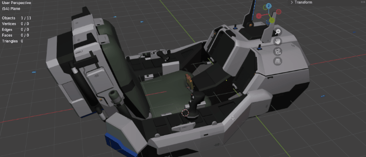
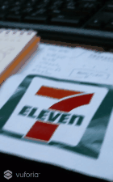
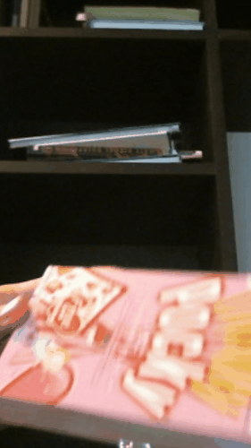

# XR AR VR

<figure><figcaption>
3D Lowpolygon Model include data
</figcaption></figure>



We design and develop immersive digital experiences using **Augmented Reality (AR), Virtual Reality (VR), and Mixed Reality (MR)** to help brands communicate, educate, and engage users in new ways.

Transform ideas into immersive experiences using augmented, virtual, and extended reality technologies.

Our solutions combine **interactive design, real-time 3D, and spatial computing** to transform ideas into experiences people can explore rather than just watch.

Whether it's a product showcase, training simulation, interactive exhibition, or location-based experience, we create applications that feel intuitive, meaningful, and memorable.

**What we build**

• AR experiences for mobile apps and marketing campaigns\
• VR simulations and training environments\
• XR installations for museums, exhibitions, and events\
• Interactive 3D storytelling and visualization\
• Real-time environments built with modern game engines

From concept and UX design to development and deployment, we help organizations bring their ideas into the world of immersive technology.



## AR VR XR เชียงใหม่ — บริการ Augmented Reality & Virtual Reality

Lunar6 คือทีมผู้เชี่ยวชาญด้าน **AR VR เชียงใหม่** ที่มีประสบการณ์กว่า 10 ปีในการออกแบบและพัฒนา Immersive Experience ให้แบรนด์และองค์กรทั้งในไทยและต่างประเทศ เราพัฒนาประสบการณ์ดิจิทัลเชิงลึกด้วยเทคโนโลยี **Augmented Reality (AR), Virtual Reality (VR) และ Mixed Reality (MR)** เพื่อให้ธุรกิจสื่อสาร ฝึกอบรม และสร้างประสบการณ์ใหม่ให้ลูกค้าได้ในแบบที่ไม่เคยมีมาก่อน

ตั้งอยู่ที่เชียงใหม่ ประเทศไทย เราพร้อมให้บริการ **AR VR Chiang Mai** แบบครบวงจร ตั้งแต่คอนเซปต์ไปจนถึงการติดตั้งใช้งานจริง

### บริการ **AR VR เชียงใหม่** ของเราครอบคลุม:

* **AR สำหรับ Mobile & Marketing** — แคมเปญ Augmented Reality บนสมาร์ทโฟนและโซเชียลมีเดีย
* **VR Training Simulation เชียงใหม่** — สร้างสภาพแวดล้อมจำลองเพื่อการฝึกอบรมที่ปลอดภัยและวัดผลได้
* **XR Installations** — งานนิทรรศการ พิพิธภัณฑ์ และอีเวนต์ทั่วเชียงใหม่และทั่วประเทศไทย
* **Interactive 3D Storytelling** — นำเสนอผลิตภัณฑ์และเรื่องราวในรูปแบบ 3D Real-time
* **Location-based AR Chiang Mai** — ประสบการณ์ AR เฉพาะพื้นที่สำหรับการท่องเที่ยวและค้าปลีก

หากคุณกำลังมองหา **บริษัท AR VR เชียงใหม่** ที่เข้าใจทั้งเทคโนโลยีและธุรกิจ Lunar6 คือทีมที่ใช่สำหรับคุณ

ทำไมต้อง Lunar6

> เพราะเรามีประสบการณ์ทำเกมมือถือและคอนโซลมาก่อน ที่ต้องบริหารทรัพยากรจำกัด เราถึงทราบของจำกัดของอุปกรณ์ และสามารถดึงความสวยงามให้เต็มประสิทธิภาพออกมากที่สุด

เราพร้อมช่วยเหลือองค์กรต่างๆ ตั้งแต่ขั้นตอนการวางคอนเซปต์, การออกแบบ UX ไปจนถึงการพัฒนาและติดตั้ง เพื่อนำไอเดียของคุณเข้าสู่โลกแห่งเทคโนโลยีเสมือนจริง (Immersive Technology) อย่างเต็มรูปแบบ


สำหรับลูกค้าที่สนใจงานที่มีคุณภาพ และต้องการคำแนะนำเชิงลึก




<figure><figcaption></figcaption></figure> <figure><figcaption></figcaption></figure>

