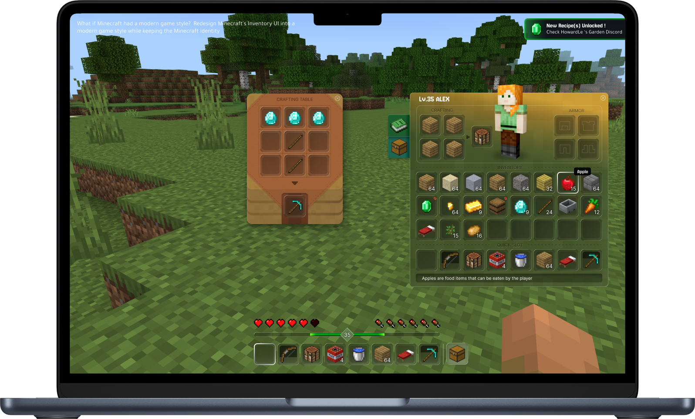
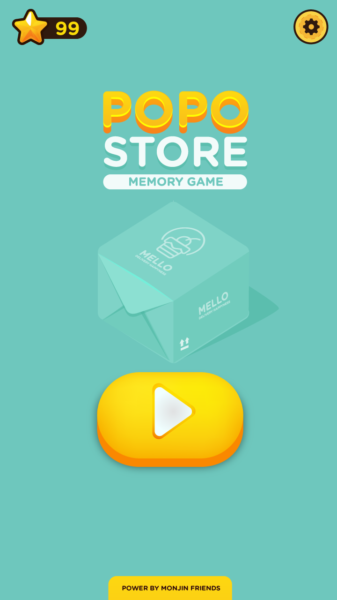
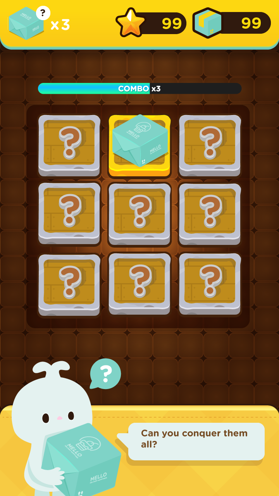
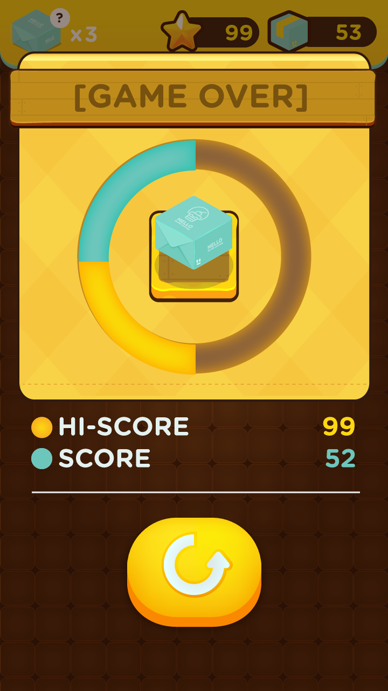
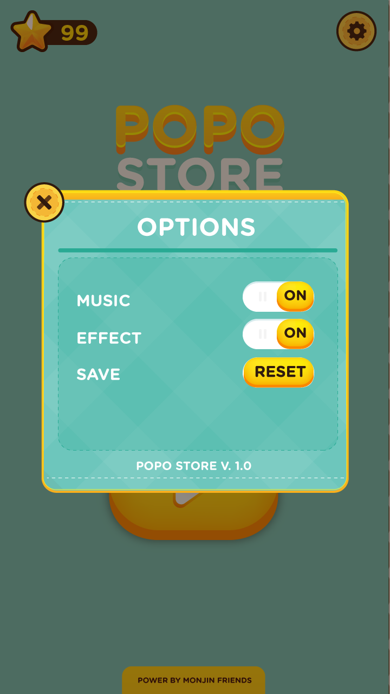
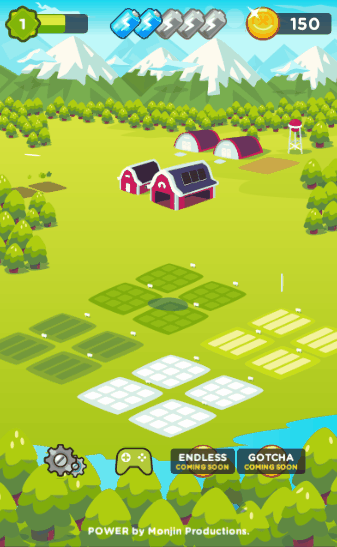
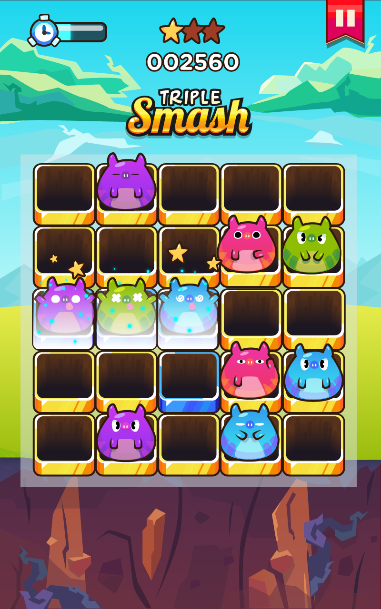
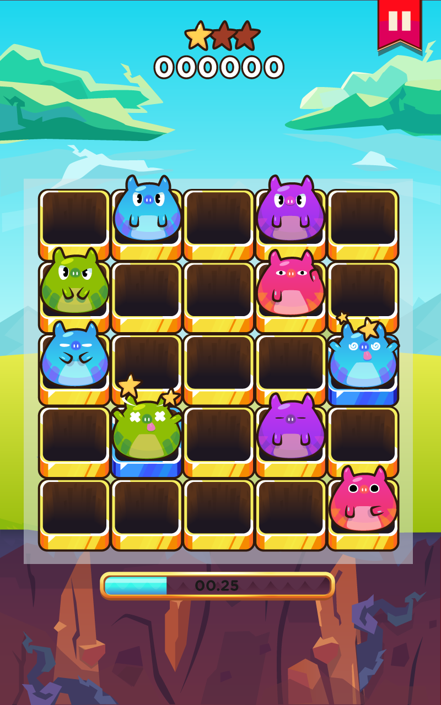

# Game Assets

We create high-quality **game-ready assets** designed for real-time engines and interactive experiences. From UI elements to environment props and stylized characters, our assets are built to integrate smoothly into modern game pipelines.

<figure><figcaption>
<a href="https://www.figma.com/proto/gU4n4iXq9t6ldsM3i7LJCf/March-Design-Challenge---Mincraft?node-id=1-3&#x26;t=lwUAVSqvzcCF7V6i-1&#x26;scaling=scale-down&#x26;content-scaling=fixed&#x26;page-id=0%3A1">[Figma] Redesign Minecraft's Inventory</a>
</figcaption></figure>

<figure><figcaption></figcaption></figure> <figure><figcaption></figcaption></figure> <figure><figcaption></figcaption></figure> <figure><figcaption></figcaption></figure>

Our focus is not just visual quality, but also **performance, usability, and production efficiency** — helping developers move faster from concept to playable results.

**What we create**

<figure><figcaption></figcaption></figure> <figure><figcaption></figcaption></figure> <figure><figcaption></figcaption></figure>

• 2D and 3D game assets\
• UI / HUD design for mobile and PC games\
• Stylized characters and props\
• Environment objects and modular assets\
• Icons, visual effects, and interface elements

All assets are optimized for engines like **Unity** and **Unreal Engine**, ensuring they are ready to use in real-time interactive projects.

Whether you're building a prototype, indie title, or full-scale production, we help provide the assets that bring your game world to life.

