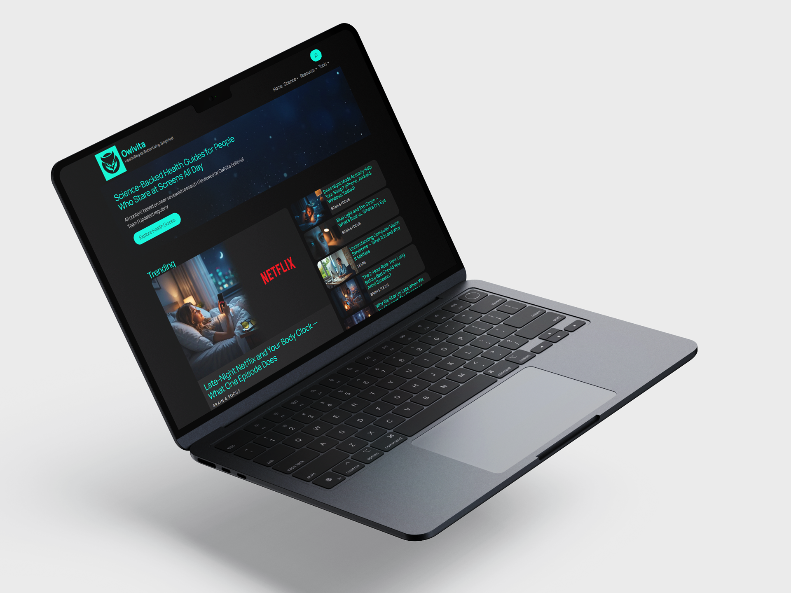
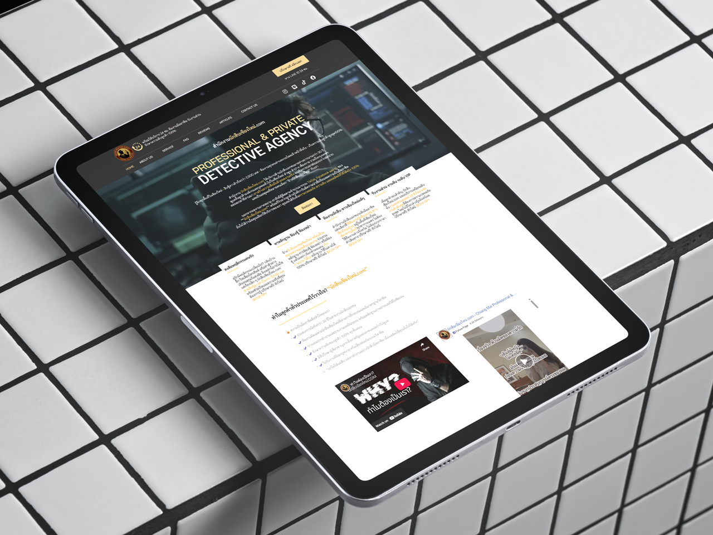
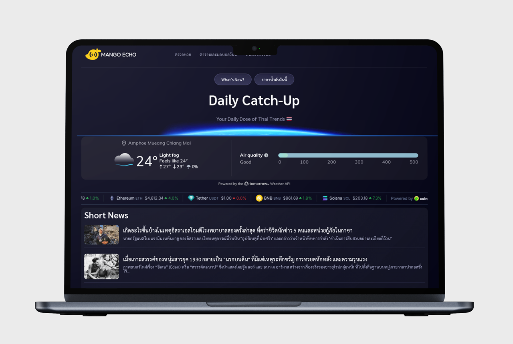
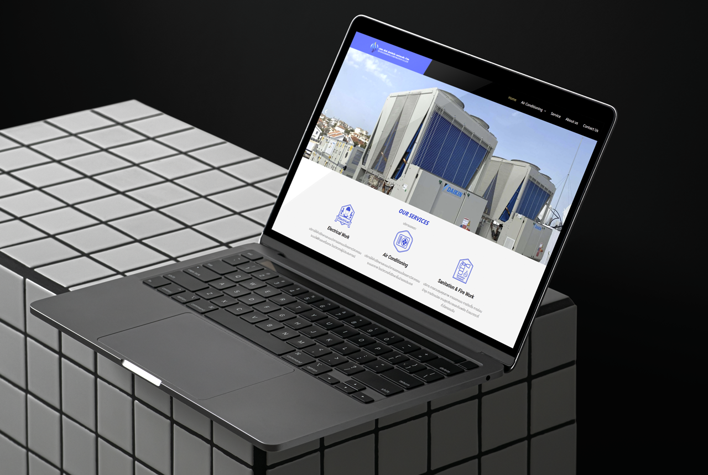
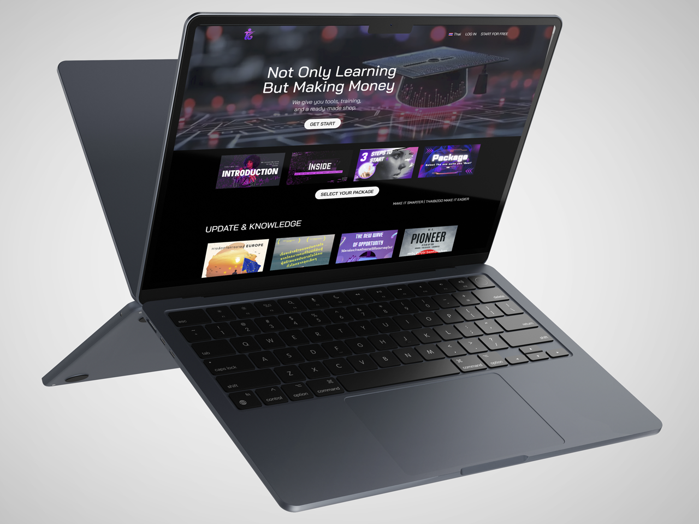
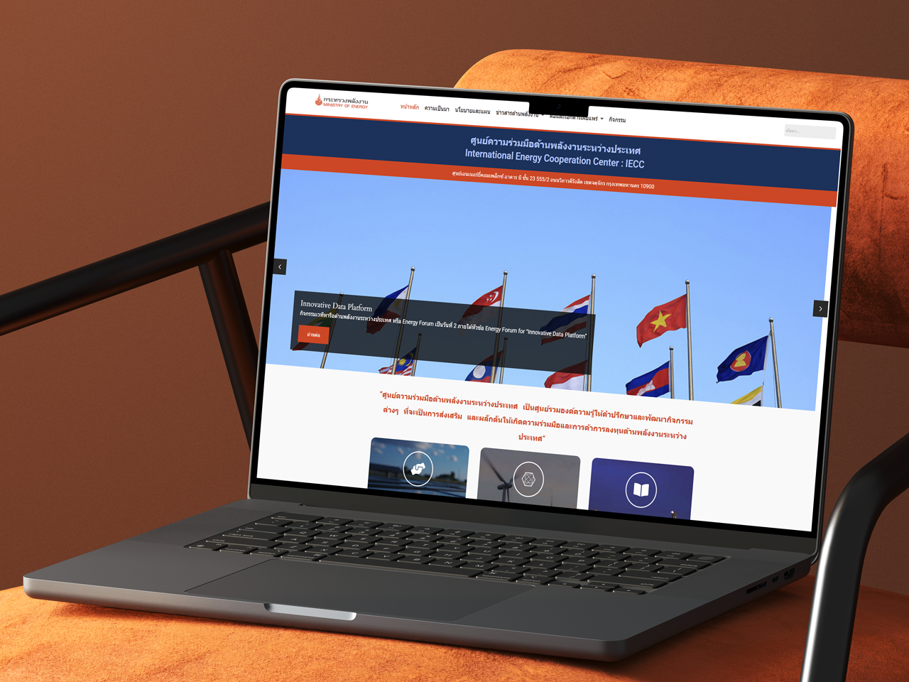

# Web Design

<figure><figcaption></figcaption></figure>



### Website Design — Chiang Mai Based, Working Worldwide 🇺🇸

Looking for a web design team that understands real products and moves fast? Our focus is not just beautiful websites — but usable, testable, developer-ready products.

***

#### ✦ What We Do Best

* Website UX/UI Design
* Product & Startup Landing Pages
* MVP Websites
* Corporate Websites
* Responsive (Mobile-first)
* Clickable Prototypes
* Website Redesign

***

#### ✦ Our Approach

Great websites should:

* Be clear from the first glance
* Visualize early through prototypes
* Work perfectly on mobile
* Be ready for developers
* Scale with your product

Small squad. Fast execution. Low friction.

***

#### ✦ Best Fit For

* Fast-moving startups
* MVP teams
* Businesses redesigning websites
* Dev teams needing production UI
* Companies seeking agile outsource partners

***

#### ✦ Based in Chiang Mai — Remote First

We operate from Chiang Mai and collaborate with teams worldwide.

***

#### ✦ Start the Conversation

Your brief doesn’t have to be perfect.\
Tell us your idea — we’ll help you visualize it.



### รับออกแบบเว็บไซต์ 🇹🇭

กำลังมองหาทีมออกแบบเว็บไซต์ที่เข้าใจโปรดักต์จริง และขับโปรเจกต์ได้เร็ว?\
ทำงานร่วมกับ startup ธุรกิจ และทีมพัฒนาทั้งในไทยและต่างประเทศ

โฟกัสของเราไม่ใช่แค่เว็บสวย\
แต่คือเว็บไซต์ที่ใช้งานได้จริง เห็นภาพเร็ว และพร้อมพัฒนาต่อทันที

***

#### ✦ สิ่งที่เราเชี่ยวชาญ

* Website UX/UI Design
* Landing Page สำหรับเปิดตัวโปรดักต์
* Startup / MVP Website
* Corporate Website
* Responsive (Mobile-first)
* Clickable Prototype
* Website Redesign

#### ✦ แนวทางของเรา

เราเชื่อว่าเว็บไซต์ที่ดีต้อง:

* เข้าใจง่ายตั้งแต่ครั้งแรก
* เห็นภาพเร็วด้วย prototype
* รองรับมือถือเต็มรูปแบบ
* ขยายต่อในอนาคตได้

ทีมเล็ก ทำงานไว คุยตรง ลดขั้นตอนที่ไม่จำเป็น

#### ✦ เหมาะกับใคร

* Startup ที่อยากเริ่มเร็ว
* ทีมที่ต้องทำ MVP
* ธุรกิจที่อยากรีดีไซน์เว็บ
* ทีม dev ที่ต้องการ UI พร้อมใช้
* บริษัทที่ต้องการ outsource ที่คล่องตัว

#### ✦ วิธีทำงาน

1. คุยเป้าหมาย
2. วางโครงสร้าง
3. ทำ Prototype
4. ส่งมอบพร้อมพัฒนา

#### ✦  ทีมของเราทำงานจากเชียงใหม่ และร่วมงานกับลูกค้าทั่วโลกแบบ remote-first

* คุยง่าย
* ทำงานไว
* เวลายืดหยุ่น

#### ✦  เริ่มคุยโปรเจกต์

ยังไม่ต้องมีบรีฟครบก็เริ่มได้\
เล่าไอเดียคร่าว ๆ เราช่วยต่อภาพให้ชัดtr



### 网站设计团队 — 清迈基地，服务全球 🇨🇳

正在寻找既懂产品又执行迅速的网站设计团队？

我们是一支总部位于清迈的数字设计团队，\
为全球的初创公司、企业和开发团队提供服务。

我们关注的不只是美观，而是**真正可用、可测试、可交付开发**的网站产品。

***

#### ✦ 我们擅长

* 网站 UX/UI 设计
* 产品 / Startup 落地页
* MVP 网站
* 企业官网
* 响应式设计（移动优先）
* 可点击原型
* 网站改版

***

#### ✦  清迈基地 · 全球协作

团队位于清迈，\
支持全球远程合作。



<figure><figcaption></figcaption></figure>

<figure><figcaption></figcaption></figure> <figure><figcaption></figcaption></figure>

<figure><figcaption></figcaption></figure> <figure><figcaption></figcaption></figure>

### Clients

* [OrangeVibes - handpicked Shopee finds, updated every day.](https://orangevibes.xyz/)
* [Owlvita - Health Blog for Better Living. Simplified.](https://owlvita.com/)
* [Chiang Mai Professional & Private Detective Agency](https://www.xn--12cmi2dg8bf5dn7c7bv2jybze.com/)
* [Ministry of energy - International Energy Cooperation Center : IECC](https://iecc.energy.go.th/)
* [NP Engineer Corporation](http://nppro.in.th/)
* Mango Echo - Automation Daily Dose of Thai Trends
* Bangkok Professional & Private Detective Agency
* Thai Biz Go - Learning to Earn Platform
* Hairléve — Hair Growth Device
* [Lunar6 Landing site](https://lunar6.netlify.app/)

### Contact

Available for project-based collaboration, long-term outsourcing partnerships, and embedded design support.

<table><thead><tr><th width="143"></th><th></th></tr></thead><tbody><tr><td>Email</td><td><a href="mailto:lunar6.dev@gmail.com">lunar6.dev@gmail.com</a></td></tr><tr><td>Line@</td><td><a href="https://line.me/R/ti/p/@409kjwfa">@409kjwfa</a></td></tr></tbody></table>
